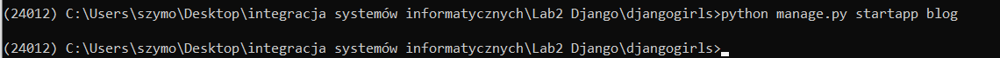
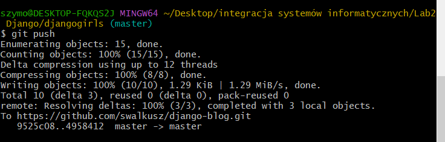
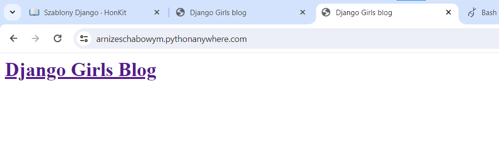

Link do repozytorium z projektem: `https://github.com/swalkusz/django-blog`  

# 1. Tworzenie środowiska wirtualnego:  

Utworzenie katalogu o nazwie *`djangogirls`*:
   ```bash
   mkdir djangogirls
   ```
   ```bash
   cd djangogirls
   ```  
   Utworzenie w powyższym folderze nowego wirtualnego środowiska o nazwie *`24012`* :
   ```bash
   python -m venv 24012
   ```
   Uruchomienie wirtualnego środowiska:
   ```bash
   24012\Scripts\activate
   ```
Tak konsola wygląda po wprowadzeniu powyższych komend:


# 2. Instalacja Django  

### 1. Aktualizacja najnowszej wersji *pip* :
```bash
python -m pip install --upgrade pip
```
### 2. Instalacja pakietów z pliku wymagań:  
Najpierw stwórz plik *`requirements.txt`* wewnątrz katalogu `djangogirls/`, następnie dodaj do niego treść:  
`Django~=3.2.10`

### 3. Teraz możesz zainstalować Django poprzez polecenie:  
```bash
pip install -r requirements.txt
```

Rezultat powinien wyglądać następująco:  


# 3. Utworzenie konta na `PythonAnywhere`  

1. Nowe konto o nazwie *`arnizeschabowym`*  
2. Wygenerowanie tokenu API:  
    Wchodzimy w zakładkę: `Account --> API Token` i klikamy `Create a new API token`  
    

# 4. Utworzenie nowego projektu Django  

### 1. Wpisz do konsoli polecenie inicjujące nowy projekt Django:  
```bash
django-admin.exe startproject mysite .
```  
W efekcie, otworzyły się nowe pliki, a struktura projektu wygląda następująco:  
  

### 2. Modyfikacja ustawień nowego projektu  
Wprowadzenie zmian w pliku *`mysite/settings.py`*  
1. Zmiana strefy czasowej  

    Zmień artybut *`TIME_ZONE`* na  
    ```python
    TIME_ZONE = 'Europe/Warsaw'
    ```  
2. Zmień kod języka  
    ```python
    LANGUAGE_CODE = 'pl-pl'
    ```  
3. Dodaj ścieżkę do plików statycznych pod linijką zawierającą *`STATIC_URL`* dodaj nową zmienną *`STATIC_ROOT`*:  
    ```py
    STATIC_ROOT = BASE_DIR / 'static'
    ```  
4. Zmiana dozwolonego hosta  
    Zmiana atrybutu *`ALLOWED_HOSTS`* na:  
    ```py
    ALLOWED_HOSTS = ['127.0.0.1', '.pythonanywhere.com']
    ```  

### Rezultat zastosowanych zmian:  

Podgląd kodu dla modyfikacji nr 1,2,3:  
  

Podgląd kodu dla modyfikacji nr 4:  
  

# 5. Inicjalizacja bazy danych  

Aby utworzyć bazę danych, należy wykonać następujące polecenie w konsoli:  
```bash
python manage.py migrate
```
  

# 6. Uruchamianie serwera WWW  

Uruchomienie  serwera następuje za pomocą polecenia:  
```bash
python manage.py runserver
```


Powyżej rezultat uruchomienia serwera  

Gdy serwer jest aktywny, można sprawdzić go w przeglądarce wpisując ustawiony wcześniej adres URL `http://127.0.0.1:8000/`  


# 7. Tworzenie aplikacji  
### 1. Aby stworzyć aplikację, należy wywołać następującą komendę:  
```bash
python manage.py startapp blog
```
  

W efekcie powstał nowy folder *`blog`* z plikami:  
  

### 2. Dodanie nowej aplikacji do listy zainstalowanych aplikacji Dockera  
Należy wprowadzić zmiany w pliku *`mysite/settings.py`*.  
Do nagłówka *`INSTALLED_APPS`* należy dodać wiersz o treści `'blog'`.  
  

# 8. Utworzenie modelu wpisu na blogu  
Modyfikacja całego pliku *`blog/models.py`*:  
```python
from django.conf import settings
from django.db import models
from django.utils import timezone


class Post(models.Model):
    author = models.ForeignKey(settings.AUTH_USER_MODEL, on_delete=models.CASCADE)
    title = models.CharField(max_length=200)
    text = models.TextField()
    created_date = models.DateTimeField(
            default=timezone.now)
    published_date = models.DateTimeField(
            blank=True, null=True)

    def publish(self):
        self.published_date = timezone.now()
        self.save()

    def __str__(self):
        return self.title    
```

# 9. Dodanie nowego modelu do bazy danych  

Poinformowanie Django o zmianach w modelu:  
```bash
python manage.py makemigrations blog
```

Zastosowanie pliku z migracjami do bazy danych:  
```bash
python manage.py migrate blog
```
  

# 10. Administracja Django (admin)  

Modyfikacja całego pliku *`blog/admin.py`*:  
```python
from django.contrib import admin
from .models import Post

admin.site.register(Post)
```

Utworzenie konta administratora (superusera) w konsoli:  
```bash
python manage.py createsuperuser
```
  

Panel logowania administratora:  
  

Panel administratora:  
  

Widok kreatora nowego wpisu:  
  

# 11. Wdrażanie  

Aby wdrożyć projekt, należy go wrzucić do repozyorium Git. 
Wszystkie akcje powinny zostać wykonane wewnątrz folderu *`djangogirls/`*  
1. Wykonanie komendy inicjującej lokalne repozytorium:  
    ```bash
    git init
    ```
2. Utworzenie w tym samym folderze pliku *`.gitingore`* i wpisanie zawartości:  
    ```
    *.pyc
    *~
    __pycache__
    24012
    db.sqlite3
    /static
    .DS_Store
    ```
    Rezultat wykonania powyższych czynności:  
    

3. Dodanie plików do repozytoium lokalnego:  
    ```bash
    git add --all .
    ```

4. Utworzenie nowego commita:  
    ```bash
    git commit -m "My Django Girls app, first commit"
    ```
5. Utworzenie nowego repozytorium na *`github.com`* (tak naprawdę nazwano jako '*django-blog*'):  


6. Podpięcie lokalnego repozytorium Git do githuba  
    ```bash
    git remote add origin https://github.com/swalkusz/django-blog.git
    ```
7. Wypchnięcie zmian do repozytorium  
    ```bash
    git push -u origin master
    ```
      

# 12. Wdrażanie bloga na PythonAnywhere  

1. Po zalogowaniu się na *https://www.pythonanywhere.com/*, należy przejść do `Dashboard --> $Bash`  
  

2. W wyświetlonej konsoli wprowadzić komendy:  
    ```bash
    pip3.6 install --user pythonanywhere
    ```

    Konfiguracja aplikacji z githubem:  
    ```bash
    pa_autoconfigure_django.py https://github.com/swalkusz/django-blog.git
    ```

    Inicjalizacja konta administratora:  
    ```bash
    python manage.py createsuperuser
    ```
    

Widok załadowanej strony na hoście *pythonanywhere.com*:  
  

Panel administratora:  


# 13. Zarządzanie adresami URL  

### 1. Import adresów URL z aplikacji *`blog`* do głównego pliku *`mysite/urls.py`*  

Aktualizacja pliku *`mysite/urls.py`*:  
```python
from django.contrib import admin
from django.urls import path, include

urlpatterns = [
    path('admin/', admin.site.urls),
    path('', include('blog.urls')),
]
```
Dzięki temu adresy URL będą obsługiwane przez *`blog.urls`*

### 2. Plik *`blog.urls`*  
Utworzenie nowego pustego pliku o nazwie *`urls.py`* w katalogu *`blog`* z zawartością:  
```python
from django.urls import path
from . import views

urlpatterns = [
    path('', views.post_list, name='post_list'),
]
```
Powyżej *`post_list`* jest nazwą widoku (view)  


Próba uruchomienia serwera, wyrzucająca błąd zgodnie z oczekiwaniami

# 14. Widoki Django  

Widok pobiera informacje od modelu, który wcześniej utworzono, a następnie przekazuje je do szablonu (template).  

Należy zmodyfikować plik *`blog/views.py`* aby wyglądał następująco:  
```python
from django.shortcuts import render

# Create your views here.

def post_list(request):
    return render(request, 'blog/post_list.html', {})
```

Podczas próby uruchomienia strony generowany jest poniższy komunikat:  
  

# 15. Szablony  

Szablony są zapisywane w katalogu *`blog/templates/blog`*.  

1. Stworzenie katalogu *`blog/templates/blog`*  
2. Stworzenie w utworzonym katalogu pliku *`post_list.html`*  
  
3. Dodanie treści do nowego pliku:  
    ```html
    <html>
        <head>
            <title>Django Girls blog</title>
        </head>
        <body>
            <div>
                <h1><a href="/">Django Girls Blog</a></h1>
            </div>

            <div>
                <p>published: 14.06.2014, 12:14</p>
                <h2><a href="">My first post</a></h2>
                <p>Aenean eu leo quam. Pellentesque ornare sem lacinia quam venenatis vestibulum. Donec id elit non mi porta gravida at eget metus. Fusce dapibus, tellus ac cursus commodo, tortor mauris condimentum nibh, ut fermentum massa justo sit amet risus.</p>
            </div>

            <div>
                <p>published: 14.06.2014, 12:14</p>
                <h2><a href="">My second post</a></h2>
                <p>Aenean eu leo quam. Pellentesque ornare sem lacinia quam venenatis vestibulum. Donec id elit non mi porta gravida at eget metus. Fusce dapibus, tellus ac cursus commodo, tortor mauris condimentum nibh, ut f.</p>
            </div>
        </body>
    </html>
    ```  

    Efekt uruchomienia wiryny po zastosowaniu zmian:  
      
    

4. Wypchięcie zmian do repozytorium na github:  
    ```bash
    git add --all .
    ```
    ```bash
    git commit -m "Zmieniony kod HTML na stronie."
    ```
    ```bash
    git push
    ```
    

5. Przesłanie nowej wersji kodu do PythonAnywhere:  

    W konsoli bash PythonAnywhere wprowadzić komendy:  
    ```bash
    cd ~/arnizeschabowym.pythonanywhere.com
    ```
    ```bash
    git pull
    ```
      

    Podgląd strony na *pythonanywhere.com*:  
      

# 16. ORM i obiekty QuerySet w Django  

Poniżesze operacje należy wykonać na lokalnej konsoli.  

### 1. Otworzenie interaktywnej konsoli Django:  
```bash
python manage.py shell
```


### 2. Import modelu *`Post`* z *`blog.models`*:  
```bash
from blog.models import Post
```

### 3. Wyświetlenie wszystkich wpisów:  
```bash
Post.objects.all()
```  

Wyświetlenie wszystkich wpisów utworzonych wcześniej na koncie administratora  


### 4. Tworzenie obiektu  

1. Import modelu *`User`*:  
    ```bash
    from django.contrib.auth.models import User
    ```

2. Wyświetlenie listy użytkowników z bazy danych:  
    ```bash
    User.objects.all()
    ```

3. Uzyskanie dostępu do instancji użytkownika:  
    ```bash 
    me = User.objects.get(username='szymon')
    ```
4. Tworzenie postu:  
    ```bash
    Post.objects.create(author=me, title='Sample title', text='Test')
    ```

5. Ponowne sprawdzenie listy wpisów:  
    ```bash
    Post.objects.all()
    ```
  

### 5. Filtrowanie obiektów  

Wyświetlenie obiektu z określonym autorem:  
```
Post.objects.filter(author=me)
```

Wyświetlenie obiektu, który w tytule zawiera frazę *`title`*:  
```
Post.objects.filter(title__contains='title')
```
Podwójne znaki podkreślenia są, aby oddzielić nazwy pól ("*title*") od operacji lub filtrów ("*contains*").  

Import strefy czasowej oraz wyświetlenie wszystkich opublikowanych wpisów:  
```
from django.utils import timezone
```
```
Post.objects.filter(published_date__lte=timezone.now())
```

Pobranie wpisu do opublikowania:  
```
post = Post.objects.get(title="Sample title")
```
Opublikowanie wpisu:  
```
post.publish()
```

Ponowne wyświetlenie opubliwoanych wpisów:  
```
Post.objects.filter(published_date__lte=timezone.now())
```


### 6. Kolejność obiektów  

Uporządkowanie elementów wg daty utworzenia, czyli pola *`created_date`*:  
```
Post.objects.order_by('created_date')
```
Odwrócenie kolejności:  
```
Post.objects.order_by('-created_date')
```
  

### 7. Łączenie QuerySetów  

```
Post.objects.filter(published_date__lte=timezone.now()).order_by('published_date')
```
  

### 8. Zamykanie konsoli  

```
exit()
```

# 17. Dane dynamiczne w szablonach Django

Modyfikacja pliku *`blog/views.py`* do postaci:  
```python
from django.shortcuts import render
from django.utils import timezone
from .models import Post

def post_list(request):
    posts = Post.objects.filter(published_date__lte=timezone.now()).order_by('published_date')
    return render(request, 'blog/post_list.html', {'posts': posts})
```

# 18. Szablony Django

Modyfikacja pliku *`blog/templates/blog/post_list.html`*:  
```html
<html>
    <head>
        <title>Django Girls blog</title>
    </head>
    <body>
        <div>
            <h1><a href="/">Django Girls Blog</a></h1>
        </div>

        
            <div>
                <p>published: {{ post.published_date }}</p>
                <h2><a href="">{{ post.title }}</a></h2>
                <p>{{ post.text|linebreaksbr }}</p>
            </div>
        

    </body>
</html>
```

`|linebreaksbr` przepuszcza wpisy przez filtr, który zamienia znaczniki nowej linii na akapity.  

Rezultat uruchomienia strony:  
  

### Można zaktualizować stronę na PythonAnywhere:  
Wypchnięcie zmian do repozytorium:  
```bash
git add .
```
```bash
git commit -m "Modified templates to display posts from database."
```
```bash
git push
```

Zaciągnięcie zmian z githuba do *PyhonAnywhere* (przez konsolę na stronie):  
```bash
cd ~/arnizeschabowym.pythonanywhere.com
```
```bash
git pull
```  

Zaktualizowana stron pythoanywhere. Pusta z powodu braku bazy danych.  



# 19. CSS

Modyfikacja pliku *`blog/templates/blog/post_list.html`*:  

1. Dodanie na początku pliku linijki:  
    ```html
    
    ```

2. Dodanie bibliotek bootstrap w sekji *`head`*:  
    ```html
    <link rel="stylesheet" href="//maxcdn.bootstrapcdn.com/bootstrap/3.2.0/css/bootstrap.min.css">
    <link rel="stylesheet" href="//maxcdn.bootstrapcdn.com/bootstrap/3.2.0/css/bootstrap-theme.min.css">
    ```

3. Zaimportowanie czcionek:  
    ```html
    <link href="//fonts.googleapis.com/css?family=Lobster&subset=latin,latin-ext" rel="stylesheet" type="text/css">
    ```

4. Załadowanie plików statycznych po wszystkich importach:  
    ```html
    <link rel="stylesheet" href="">
    ```  
    Podgląd pliku *`post_list.html`*:
    

5. Utworzenie nowego folderu *`static`* na pliki statyczne:  


6. Utworzenie wewnątrz nowego folderu, kolejnego o nazwie *`css`*, oraz w jego wnętrzu pliku *`blog.css`*:  
  

7. Utworzenie zawartości pliku *`blog/static/css/blog.css`*:  
    ```css
    h1 a, h2 a {
        color: #C25100;
        font-family: 'Lobster';
    }

    body {
        padding-left: 15px;
    }
    ```
Podgląd strony po zmodyfikowaniu szaty graficznej:  


8. Rozbudowa pliku *`post_list.html`* o dodanie klas w znacznikach *`div`*:  
    ```html
    <div class="page-header">
        <h1><a href="/">Django Girls Blog</a></h1>
    </div>
    ```

    ```html
    <div class="post">
        <p>published: {{ post.published_date }}</p>
        <h2><a href="">{{ post.title }}</a></h2>
        <p>{{ post.text|linebreaksbr }}</p>
    </div>
    ```

9. Rozbudowa pliku *`blog.css`* poprzez dodanie kodu:  
    ```css
    .page-header {
        background-color: #C25100;
        margin-top: 0;
        padding: 20px 20px 20px 40px;
    }

    .page-header h1, .page-header h1 a, .page-header h1 a:visited, .page-header h1 a:active {
        color: #ffffff;
        font-size: 36pt;
        text-decoration: none;
    }

    .content {
        margin-left: 40px;
    }

    h1, h2, h3, h4 {
        font-family: 'Lobster', cursive;
    }

    .date {
        color: #828282;
    }

    .save {
        float: right;
    }

    .post-form textarea, .post-form input {
        width: 100%;
    }

    .top-menu, .top-menu:hover, .top-menu:visited {
        color: #ffffff;
        float: right;
        font-size: 26pt;
        margin-right: 20px;
    }

    .post {
        margin-bottom: 70px;
    }

    .post h2 a, .post h1 a:visited {
        color: #000000;
    }
    ```

10. Zamiana fragmentu kodu z pliku *`post_list.html`* z postaci:  
    ```html
    
        <div class="post">
            <p>published: {{ post.published_date }}</p>
            <h2><a href="">{{ post.title }}</a></h2>
            <p>{{ post.text|linebreaksbr }}</p>
        </div>
    
    ```
    na:  
    ```html
    <div class="content container">
        <div class="row">
            <div class="col-md-8">
                
                    <div class="post">
                        <div class="date">
                            <p>published: {{ post.published_date }}</p>
                        </div>
                        <h2><a href="">{{ post.title }}</a></h2>
                        <p>{{ post.text|linebreaksbr }}</p>
                    </div>
                
            </div>
        </div>
    </div>
    ```

Widok witryny po zmianach:  


# 20. Rozbudowa szablonów

### Tworzenie szablonu bazowego 

1. Stworzenie nowego pliku *`base.html`* w katalogu *`blog/templates/blog/`*:  
  

2. Skopiowanie zawartości pliku *`post_list.html`* do *`base.html`*  
3. Zmiana zawartości znacznika `body` pliku *`base.html`* na:  
    ```html
    <body>
        <div class="page-header">
            <h1><a href="/">Django Girls Blog</a></h1>
        </div>
        <div class="content container">
            <div class="row">
                <div class="col-md-8">
                
                
                </div>
            </div>
        </div>
    </body>
    ```

4. Modyfikacja pliku *`post_list.html`* do stanu:  
    ```html
    

    
        
            <div class="post">
                <div class="date">
                    {{ post.published_date }}
                </div>
                <h2><a href="">{{ post.title }}</a></h2>
                <p>{{ post.text|linebreaksbr }}</p>
            </div>
        
    
    ```  

Podgląd kodów obu plików html:  


# 21. Rozbudowa aplikacji  

### 1. Tworzenie szablonu odnośnika do detali wpisu na blogu  

#### Dodanie linku wewnątrz pliku *`blog/templates/blog/post_list.html`* poprzez modyfikację linijki:  
```html
<h2><a href="">{{ post.title }}</a></h2>
```
na:  
```html
<h2><a href="">{{ post.title }}</a></h2>
```
### 2. Utworzenie URL dla poszczególych wpisów:  

Zmodyfikowanie pliku *`blog/urls.py`* do postaci:  
```python
from django.urls import path
from . import views

urlpatterns = [
    path('', views.post_list, name='post_list'),
    path('post/<int:pk>/', views.post_detail, name='post_detail'),
]
```

### 3. Dodanie widoku dla poszczególnego wpisu  

Dodanie kodu do pliku *`blog/views.py`*:
```python
from django.shortcuts import render, get_object_or_404
```
```python
def post_detail(request, pk):
    post = get_object_or_404(Post, pk=pk)
    return render(request, 'blog/post_detail.html', {'post': post})
```

### 4. Stworzenie nowego szablonu dla poszczególnego wpisu  

1. Utworzenie w folderze *`blog/templates/blog`* pliku *`post_detail.html`*:  
  

2. Dodanie treści do nowego pliku:  
    ```html
    

    
        <div class="post">
            
                <div class="date">
                    {{ post.published_date }}
                </div>
            
            <h2>{{ post.title }}</h2>
            <p>{{ post.text|linebreaksbr }}</p>
        </div>
    
    ```

### 5. Wypchnięcie zmian do githuba:  
```bash
git add .
```
```bash
git commit -m "Added view and template for detailed blog post as well as CSS for the site."
```
```bash
git push
```

### 6. Załadowanie zmian na PythonAnywhere:  
```bash
cd ~/arnizeschabowym.pythonanywhere.com
```

```bash
git pull
```

Po załadowaniu zmian z githuba, należy załadować pliki statyczne. Najpierw należy upewnić się że ścieżka którą wskazuje konsola *pythonanywhere*, zawiera plik *`manage.py`*.  

Uruchomienie środowiska wirtualnego:  
```bash
workon arnizeschabowym.pythonanywhere.com 
```

Załadowanie plików statycznych:  
```bash
python manage.py collectstatic
```

Po wprowadzeniu komend, zatwierdzić zmiany wpisując `yes`.  


Prezentacja strony na hoście *pythonanywhere.com*:  


# 22. Formularze Django

### 1. Tworzenie formularza  

Stworzenie w folderze *`blog`* pliku *`forms.py`*:  


Wprowadzenie kodu do pliku *`blog/forms.py`*:  
```python
from django import forms

from .models import Post

class PostForm(forms.ModelForm):

    class Meta:
        model = Post
        fields = ('title', 'text',)
```

### 2. Odnośnik do strony z formularzem

Modyfikacja pliku *`blog/templates/blog/base.html`* poprzez dodanie linijki wewnątrz elementu `div` o klasie *`page-header`*:  
```html
<a href="" class="top-menu"><span class="glyphicon glyphicon-plus"></span></a>
```


### 3. Adres URL

Modyfikacja pliku *`blog/urls.py`* poprzez dodanie linijki: 
```py
path('post/new', views.post_new, name='post_new'),
```
Plik po modyfikacji:  
```py
from django.urls import path
from . import views

urlpatterns = [
    path('', views.post_list, name='post_list'),
    path('post/<int:pk>/', views.post_detail, name='post_detail'),
    path('post/new/', views.post_new, name='post_new'),
]
```

### 4. Widok post_new

Modyfikacja pliku *`blog/views.py`* poprzez dodanie linijek:  
```py
from .forms import PostForm
```

```py
def post_new(request):
    form = PostForm()
    return render(request, 'blog/post_edit.html', {'form': form})
```  

Po modyfikacji plik powinien wyglądać następująco:  
```py
from django.shortcuts import render
from django.utils import timezone
from .models import Post
from django.shortcuts import render, get_object_or_404
from .forms import PostForm

# Create your views here.

def post_list(request):
    posts = Post.objects.filter(published_date__lte=timezone.now()).order_by('published_date')
    return render(request, 'blog/post_list.html', {'posts': posts})

def post_detail(request, pk):
    post = get_object_or_404(Post, pk=pk)
    return render(request, 'blog/post_detail.html', {'post': post})

def post_new(request):
    form = PostForm()
    return render(request, 'blog/post_edit.html', {'form': form})
```

### 5. Szablon

1. Utworzenie nowego pliku *`post_edit.html`* w katalogu *`blog/templates/blog`*.  
2. Dodanie treści do pliku:  
    ```html
    

    
        <h2>New post</h2>
        <form method="POST" class="post-form">
            {{ form.as_p }}
            <button type="submit" class="save btn btn-default">Save</button>
        </form>
    
    ```


### 6. Zapisanie formularza

#### Modyfikacja pliku *`blog/views.py`*  

Dodanie importu w pierwszej linijce:  
```py
from django.shortcuts import redirect
```

Zastąpienie metody *`post_new`*:  
```py
def post_new(request):
    if request.method == "POST":
        form = PostForm(request.POST)
        if form.is_valid():
            post = form.save(commit=False)
            post.author = request.user
            post.published_date = timezone.now()
            post.save()
            return redirect('post_detail', pk=post.pk)
    else:
        form = PostForm()
    return render(request, 'blog/post_edit.html', {'form': form})
```

Utworzony post:  


### 7. Edycja formularza

#### 1. Modyfikacja pliku *`blog/templates/blog/post_detail.html`*

Dodanie lini kodu:  
```html
<a class="btn btn-default" href=""><span class="glyphicon glyphicon-pencil"></span></a>
```

Zawartość pliku po zmianie:  
```html



    <div class="post">
        
            <div class="date">
                {{ post.published_date }}
            </div>
        
        <a class="btn btn-default" href=""><span class="glyphicon glyphicon-pencil"></span></a>
        <h1>{{ post.title }}</h1>
        <p>{{ post.text|linebreaksbr }}</p>
    </div>

```

#### 2. Modyfikacja pliku *`blog/urls.py`*

Dodanie do tablicy *`urlpatterns`* linijki:  
```py
path('post/<int:pk>/edit/', views.post_edit, name='post_edit'),
```

#### 3. Modyfikacja pliku *`blog/views.py`*

Dodanie metody:  
```py
def post_edit(request, pk):
    post = get_object_or_404(Post, pk=pk)
    if request.method == "POST":
        form = PostForm(request.POST, instance=post)
        if form.is_valid():
            post = form.save(commit=False)
            post.author = request.user
            post.published_date = timezone.now()
            post.save()
            return redirect('post_detail', pk=post.pk)
    else:
        form = PostForm(instance=post)
    return render(request, 'blog/post_edit.html', {'form': form})
```
Dzięki zastosowanym zmianom pojawiła się opcja edycji:  
  

Ten sam post po edycji:  
  

### 8. Bezpieczeństwo

Określono tutaj bezpieczeństwo w zakresie autoryzacji do tworzenia i modyfikacji postów.  

#### 1. Modyfikacja pliku *`blog/templates/blog/base.html`*

Zmiana linijki: 
```html
<a href="" class="top-menu"><span class="glyphicon glyphicon-plus"></span></a>
```
na:  
```html

    <a href="" class="top-menu"><span class="glyphicon glyphicon-plus"></span></a>

```

#### 2. Modyfikacja pliku *`blog/templates/blog/post_detail.html`*

Zmiana linijki: 
```html
<a class="btn btn-default" href=""><span class="glyphicon glyphicon-pencil"></span></a>
```
na:  
```html

     <a class="btn btn-default" href=""><span class="glyphicon glyphicon-pencil"></span></a>

```

### 9. Wdrożenie na pythonanywhere

#### Lokalna konsola na komuterze:  
```bash
git add .
```
```bash
git commit -m "Added views to create/edit blog post inside the site."
```
```bash
git push
```

#### Konsola *pythonanywhere*:  

```bash
cd ~/arnizeschabowym.pythonanywhere.com
```
```bash
git pull
```

Wprowadzone zmiany na hoście *pythonanywhere.com*:  
