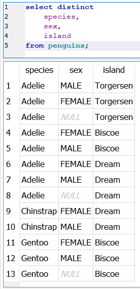
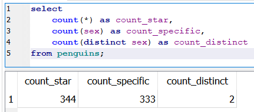
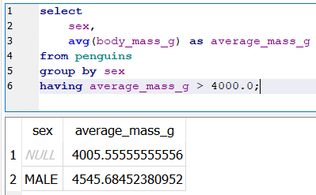
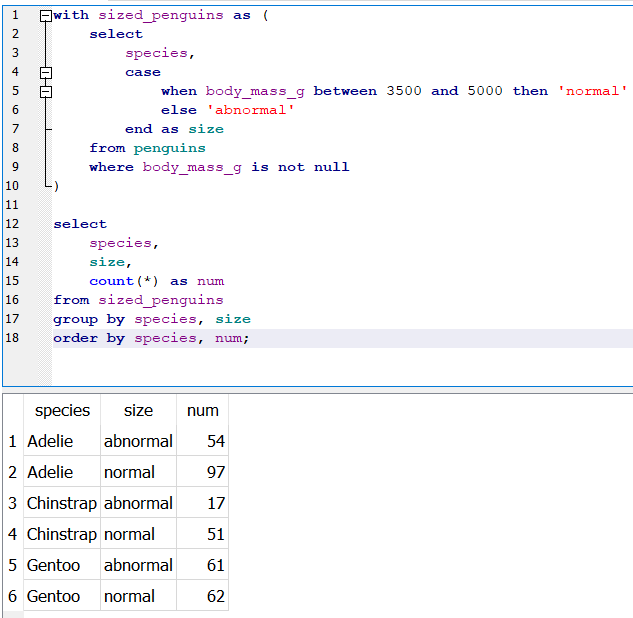

# SQLite

## Wywołanie komend SQLite za pomocą skryptu w pythonie  

W poniższym kodzie funkcja `create_connectrion()` tworzy połączenie z plikiem z bazy danych oraz wyświetla wyniki. `sql_query()` zwraca kod *SQL*. 

```py
import sqlite3
from sqlite3 import Error

def create_connectrion(filename):
    conn = sqlite3.connect(filename)
    try:
        c = conn.cursor()
        c.execute(sql_query())
        for row in c.fetchall():
            print(row)
    except Error as e:
        print(e)
    conn.close()

def sql_query():
    return """select * from little_penguins;"""


if __name__ == '__main__':
    create_connectrion("sql-tutorial/db/penguins.db")
```
W rezultacie wywołania kodu, otrzymujemy następujące wyniki:  
  


Na potrzeby wykonania zadań, dla zwiększenia czytelności wyników, skrypty *sql* zostaną wykonane za pomocą programu `DB Browser for SQLite`. Poniżej ten sam wynik w tym programie:  
  

## Zadania z tutoriala  

1. Specyfikowanie kolummn:  


2. Sortowanie  
  

3. Limitowanie liczby wyników  
  

4. Przesunięcie wyników  
  

5. Usuwanie duplikatów  
  

6. Filtrowanie wyników  
  

7. Złożone filtrowanie  
  

8. Kalkulacje  
  

9. Nazywanie kolumn  
  

10. Kalkulacje z brakujacymi wartościami  
  

11. Logika trójskładnikowa  
   

12. Przechwytywanie wartośći *NULL*  


13. Agregacja - łączenie  
  
  
  

14. Grupowanie  
  

15. Niezaagregowane kolumny  
  

16. Filtrowanie zaagregowanych wartości  
  

17. Zwiększanie czytelności - Zaokrąglanie  
  

18. Filtrowanie zaagragowanych wartości  
`filter()`  
  

19. Tworzenie tabel  
```sql
create table job (
    name text not null,
    billable real not null
);
create table work (
    person text not null,
    job text not null
);
```  
  

20. Wstawianie danych do tabeli  
```sql
insert into job values
('calibrate', 1.5),
('clean', 0.5);
insert into work values
('mik', 'calibrate'),
('mik', 'clean'),
('mik', 'complain'),
('po', 'clean'),
('po', 'complain'),
('tay', 'complain');
```  
  

21. Aktualizacja rekordów  
```sql
update work
set person = 'tae'
where person = 'tay';
```  
  

22. Usuwanie wierszy  
  

23. Tworzenie kopii zapasowych  
  

24. Złączenia  
>CROSS JOIN  
   

>INNER JOIN  
   

>Agregacja złączeń  
  

>LEFT JOIN  
   

>Agregacja Left Join  


>Coalescing Values  
Zwraca pierwszą wartość inną od *null*  
  

25. Negacja  
  

26. Przynależność elementu  
  

27. Pozdzapytania  
  

28. Klucz podstawowy  
  

29. Autoinkrementacja klucza głównego  
  

30. Altering Tables - dodawanie kolumn   
  

31. Usuwanie tabel  
```sql
drop table work;
alter table new_work rename to work;
```  

32. Warukowe tworzenie tabeli  
  

33. Filtrowanie wartości indywidualnych z agregowanymi  
  

34. Comparing Individual Values to Aggregates Within Groups  
  

35. Common Table Expressions  
  

36. Explaining Query Plans  
  

37. Enumerating Rows - Indeksy wierszy  
  

38. Conditionals  
`iif(condition, true_result, false_result)`  
  

39. Selecting a Case  
  

40. Checking a Range  
  

41. Pattern Matching  
  

42. Selecting First and Last Rows  
  

43. Intersection - podobne do where  
  

44. Exclusion - wykluczenie  
  

45. Random Numbers and Why Not  
  

46. Self Join  
zwraca w tym przypadku wszystkie kombinacje  
  

47. Existence and Correlated Subqueries  
  

48. Nonexistence  
  

49. Avoiding Correlated Subqueries  
  

50. Lead and Lag  
  

51. Windowing Functions  
  

52. Partitioned Windows  
  

53. Storing JSON  


54. Select Fields from JSON  
```sql
select
    details->'$.acquired' as single_arrow,
    details->>'$.acquired' as double_arrow
from machine;
```  
  
  

55. JSON Array Access  
```sql
select
    ident,
    json_array_length(log->'$') as length,
    log->'$[0]' as first
from usage;
```  
  
  

56. Unpacking JSON Arrays  
```sql
select
    ident,
    json_each.key as key,
    json_each.value as value
from usage, json_each(usage.log)
limit 10;
```  
  
  

57. Selecting the Last Element of an Array  
```sql
select
    ident,
    log->'$[#-1].machine' as final
from usage
limit 5;
```  
  

58. Modifying JSON  
  

59. Tombstones  
  

60. Hours Reminder  
  

61. Representing Graphs  
  

62. Recursive Queries  
  

63. Bidirectional Contacts  
```sql
create temporary table bi_contact (
    left text,
    right text
);

insert into bi_contact
select
    left, right from contact
    union all
    select right, left from contact
;
```  

64. Updating Group Identifiers  
  

65. Recursive Labeling  
  

### Python  

---

66. Querying from Python  
  
  

67. Incremental Fetch  
  
  

68. Insert, Delete, and All That  
  
  

69. Interpolating Values  
  
  

70. Script Execution  
  
  

71. SQLite Exceptions in Python  
  
  

72. Python in SQLite  
  
  

73. Handling Dates and Times  
  
  

74. Pandas and SQL  
instalacja biblioteki pandas:  
```bash
pip install pandas
```  
  
  

